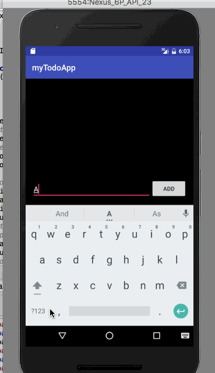

# myTodoAppExtended

This is an android To-Do application.

Time spent: 4 hours spent in total

Completed user stories:

 * [x] Required: Users can add items to the list
 * [x] Required: Users can remove items by long clicking a particular item in the list.
 * [X] Required: Add an edit feature to the to-do list.

A simple To do app that helps you track things. You can add an item, delete it after its done and edit an existing item

Note: I have finished the required user stories and submitting my first draft here. Will continue to work on additional features and will update the code.

Additional user stories:

 * [x] (Suggested) Persist the todo items into SQLite instead of a text file using SQLiteOpenHelper or DBFlow
 * [x] (Suggested) Improve style of the todo items in the list using a custom adapter
 * [x] (Suggested) Add support for completion due dates for todo items (and display within listview item)
 * [x] (Suggested) Use a DialogFragment instead of new Activity for editing items

A simple To do app that helps you track things. You can add an item, delete it after its done and edit an existing item. One can also store the to do date for the task

